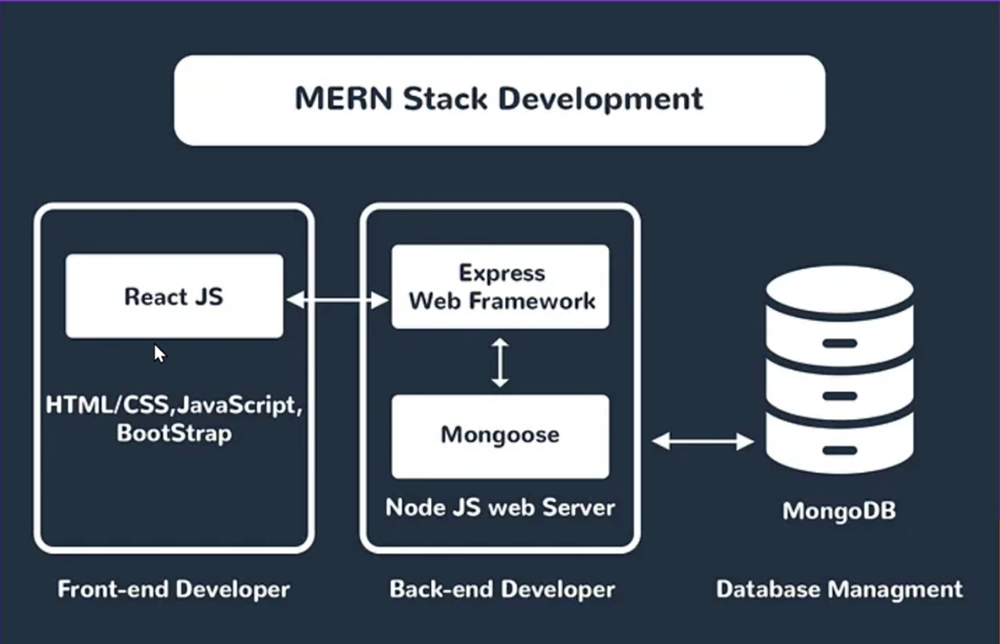

# 트위치 클론 사이트 만들기 1일차 

# Section 1: 앱 프리뷰와 이론 정리

## 1) 애플리케이션 프리뷰

본 프로젝트에서는 트위치와 유사한 프로젝트를 만들것임을 가볍게 이야기 함.

## 2) 구조

- mongoDB
- expressJS
- React
- nodeJS
- socket IO

위 5가지 스택을 사용하여 구현 할 것임을 이야기함.

  

### MERN 스택 개발 (chatGPT 정리)

MERN 스택은 **MongoDB**, **Express.js**, **React.js**, **Node.js**를 활용한 웹 개발 방식입니다. 각 기술은 웹 애플리케이션의 다른 부분을 담당합니다:

1. **MongoDB**: 
    - 비관계형 데이터베이스
    - 유연한 데이터 저장 및 관리
    - JSON과 유사한 문서 기반 데이터 모델 사용

2. **Express.js**: 
    - Node.js를 위한 웹 애플리케이션 프레임워크
    - 빠르고 개방적이며 최소한의 기능 제공
    - 라우팅, 미들웨어, 요청 처리 등을 단순화

3. **React.js**: 
    - 사용자 인터페이스 구축을 위한 JavaScript 라이브러리
    - 컴포넌트 기반 접근 방식
    - 재사용 가능하고 유지보수가 쉬운 UI 생성

4. **Node.js**: 
    - 서버 측 JavaScript 런타임 환경
    - 비동기적, 이벤트 기반 설계
    - 효율적이고 확장 가능한 네트워크 애플리케이션 구현

MERN 스택은 이러한 기술들을 통합하여 웹 애플리케이션의 전체 스택 개발을 가능하게 합니다. JavaScript를 사용하는 이 스택의 장점은 하나의 언어로 프론트엔드와 백엔드를 모두 다룰 수 있다는 것입니다.

## 3) MongoDB 설명

- mongoDB는 javascript와 유사한 방식으로 데이터를 저장한다.
- 굉장히 유연성이 있고, 다양한 데이터를 저장하기에 적합하다.
- 캐싱시스템에 기반하기 때문에 성능이 굉장히 좋다.

## 4) Express 설명

- 굉장히 단순하게 웹 어플리케이션을 구현할 수 있다.
- 굉장히 빠르게 만들고 개발할 수 있다. (간단한 어플리케이션 개발에 최적의 선택이다.)

## 5) React 설명

- 가장 인기있는 클라이언트 자바스크립트 프레임워크이다.
- 컴포넌트 기반의 개발을 하여 재사용성이 높다.

## 6) NodeJS 설명

- 자바스크립트를 사용한 서버 사이드 엔진이다.
- 비동기적으로 여러 데이터를 한 번에 처리하여 속도가 빠르다.

## 7) Socekt IO 설명

- 클라이언트와 서버간의 실시간 소통을 할 수 있게 해준다.
- 룸 기반의 통신 구현을 통해, 같은 룸 안에 있는 사람들과 실시간으로 통신할 수 있다.

## 8) MERN Stack의 장점

- 순수하게 자바스크립트만을 이용한 풀 스택 개발이 가능하다. (자바스크립트 전문가 만으로 개발 팀 구성이 가능하다.)
- MongoDB의 flexible한 데이터와 express, react 간의 효율적인 데이터 플로우 구성이 가능하다.
- MongoDB의 샤딩기술과 node.JS의 비동기 작업이 서로 상성이 좋다.
- npm, react 라이브러리 등 사용할 수 있는 라이브러리가 풍부하다.
- 다양한 커뮤니티가 존재하여 참고할 수 있는 자료가 많다.

## Section2

서버 구동에 필요한 라이브러리들을 설치하고, Express 서버를 구동하는데 까지 성공하였음.