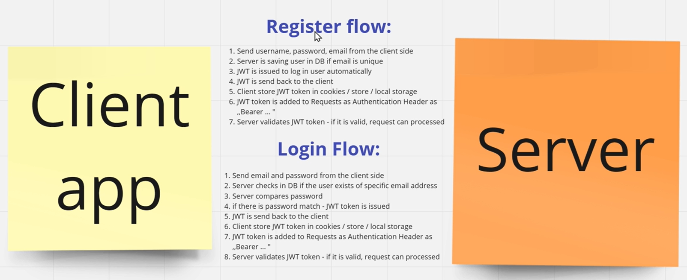

# 트위치 클론 사이트 만들기 3일차 

## Section 4: MongoDB 커넥션

MongoDB 테이블을 생성하고, 데이터 저장하는 부분까지 구현 완료

## Section 5 JWT 인증 구현

  

### Register Flow
1. 클라이언트 단에서 username, password, email을 전송 받습니다.
2. 서버에서 email이 겹치는 데이터를 검증합니다.
3. 사용자 정보에 대한 JWT를 발급합니다. 
4. 비밀번호를 암호화 합니다.
5. JWT를 클라이언트로 response 합니다.
6. 클라이언트 단에서 JWT를 저장합니다.
7. JWT 토큰을 헤더에 추가합니다.
8. 서버에서 JWT 토큰을 인증합니다.

### Login Flow
1. 클라이언트 단에서 email, password를 받습니다.
2. 해당 유저가 존재하는지 가져옵니다.
3. 비밀번호가 일치하는지 확인합니다.
4. 비밀번호가 일치하면 JWT 토큰을 발급합니다.
5. 클라이언트로 JWT 토큰을 응답합니다.
6. 클라이언트 단에서 JWT 토큰을 저장합니다.
7. JWT 토큰을 헤더에 추가합니다.
8. 서버에서 JWT 토큰을 인증합니다.

## 강의 계획

생각보다 진도가 잘 안나가서 좀 미뤄질듯

- Section 4,5 : 12/13 (수)
- Section 6 : 12/14 (목)
- Section 7 : 12/15 (금)
- Section 8, 9,10,11 : 12/16 (토)
- 전체 강의 정리 및 차기 계획 만들기 : 12/17 (일)