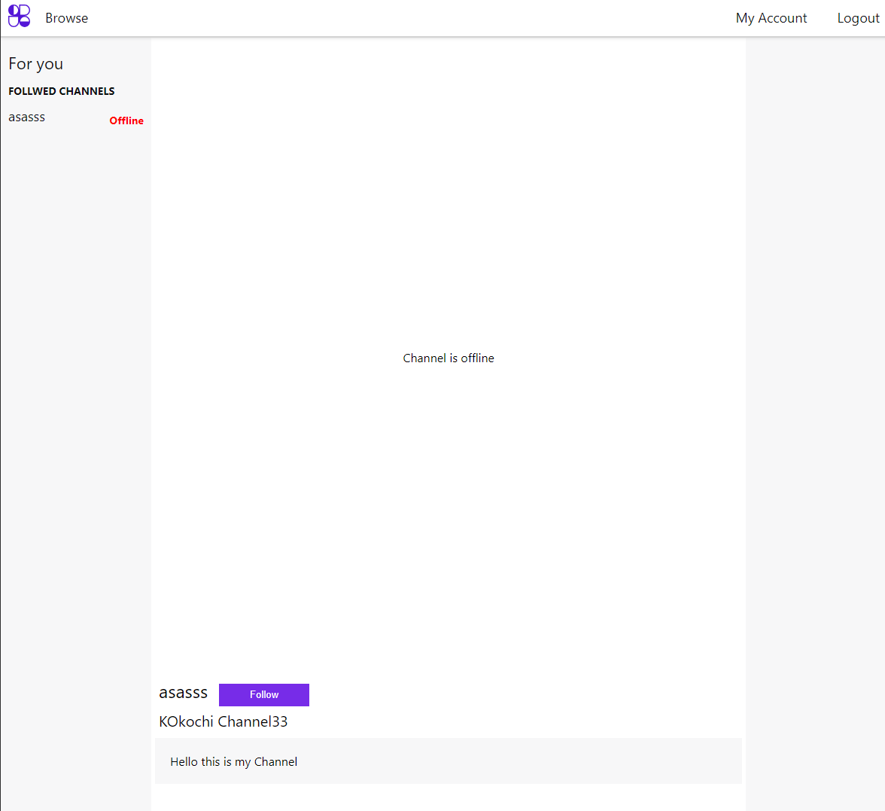
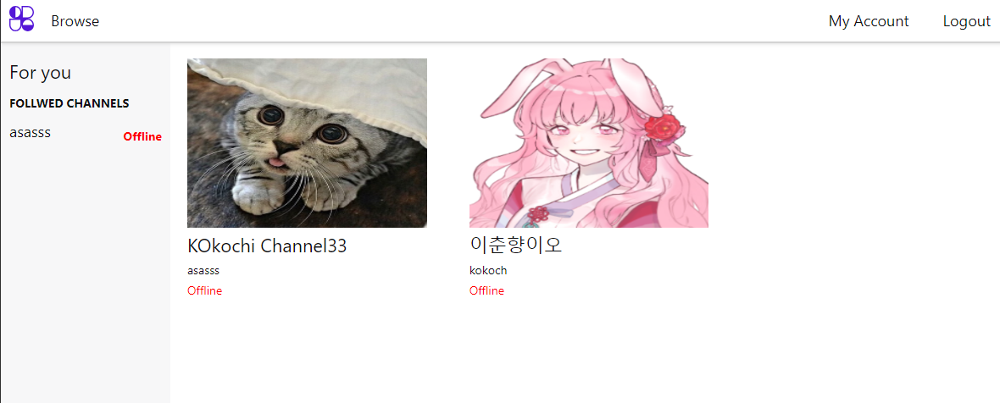

# 트위치 클론 사이트 만들기 8일차 

## Section 9: 클라이언트 대시보드와 API 연결

서버에서 생성한 팔로우기능, 리스팅 기능 등등을 서버기능과 본격적으로 연결한다.

1. 채널 설정 서버 연동
2. 팔로우 목록 서버 연동
3. 채널 기본정보 서버 연동
4. 스트리머 팔로우하기 기능 생성

 

  

섹션 10은 다시 추가 작업 후에 commit 될 예정

## 강의 계획

- Section 9, 10 : 12/23 (토)
- Section 11, 전체 강의 정리 및 차기 계획 만들기 : 12/24 (일)