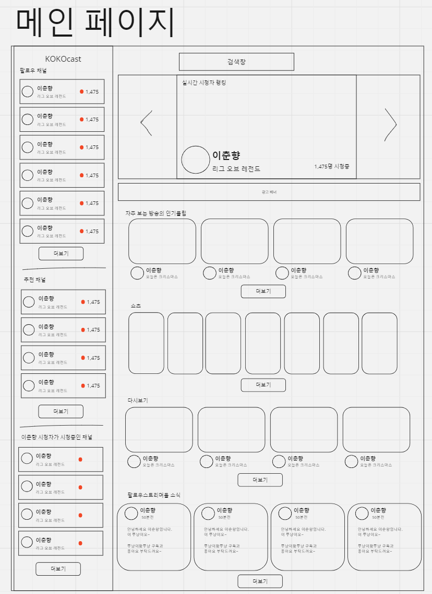
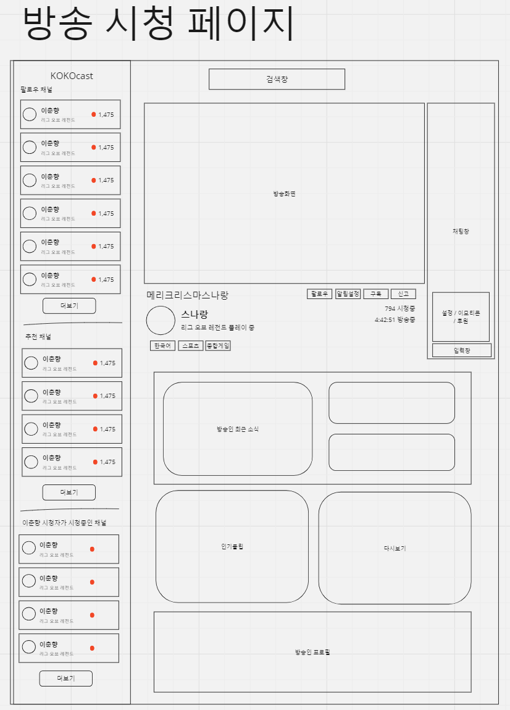
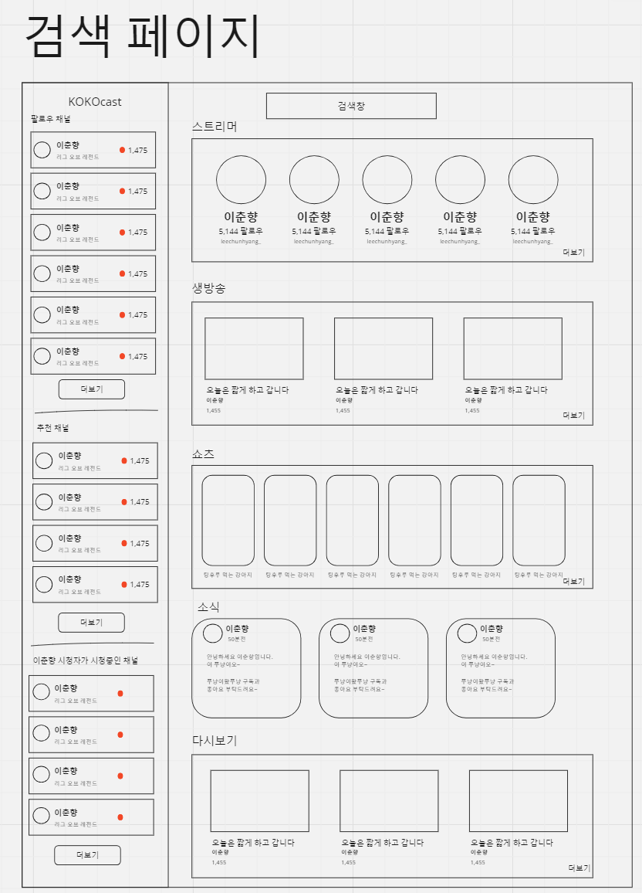
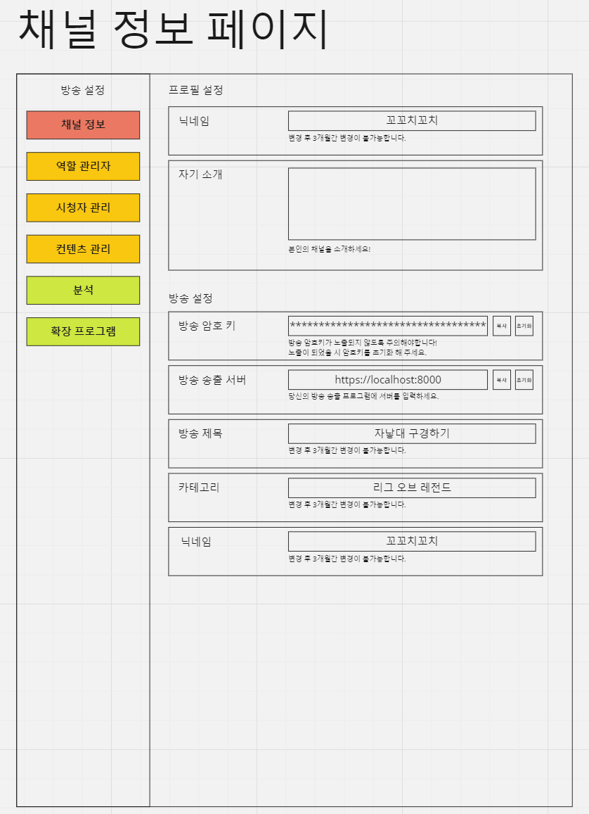

# kokoCast 최초기획

## 구현 계획

- 사용자
    - 로그인
    - 회원가입
    - 쿠키 암호화
    - 팔로우
    - 구독
    - 알림설정
    - 밴
- 방송
    - 채널 설정
    - 실시간 방송
    - 다시보기
    - 클립
    - 채팅
    - 투표 열기 / 도박
    - 결제
    - 도네이션 (방송에 도네 띄우기)
    - 영상 도네이션
    - 음성 도네이션
    - TTS
    - 룰렛
- 기타
    - 커뮤니티
    - 검색
    - 추천 스트리머
    - 추천 클립
- OBS 연동
    - 제목 연동 (OBS에서 제목/카테고리 설정)
    - 채팅창 연동 (채팅창 띄우기)

## 구현 기술

- 중앙 서버 : Spirng boot
- 클라이언트 : React
- DB : MongoDB
- RTMP 서버 : nodeJs(NodeMediaServer)

## 구현 일정

일단 핵심적인 기술 위주로 구현을 하고, 이후에 추가적으로 넣고싶은 기능들을 추가하는것으로 선정.

필수적인 핵심 기능을 중심으로 우선순위를 매긴다.

### 우선순위 1
- 메인 (19)
    - 디자인 방식 (5)
        - 탬플릿 / 엔진 / 구현방식 확인
    - 메인 페이지 디자인 (5)
    - 방송 시청 페이지 디자인 (3)
    - 사용자 설정 페이지 디자인 (3)
    - 검색 페이지 디자인 (3)
- 사용자 (17)
    - 로그인 / 회원가입 (13)
        - 사용자 DB 생성 (2)
        - 암호화 / 로그인 / 회원가입 서버 구현 (3)
        - 로그인 페이지 생성 (2)
        - 회원가입 페이지 생성 (2)
        - 클라 / 서버 연동 (2)
        - 채널 DB 생성 (2)
    - 팔로우 (4)
        - 서버 팔로우 기능 구현 (2)
        - 방송 시청 페이지 팔로우 버튼 연동 (2)
- 방송 (25)
    - 채널 설정 (5)
        - 채널 설정 폼 생성 (2)
        - 채널 설정 서버 연동 (3)
    - 실시간 방송 (10)
        - RTMP 서버 생성 (2)
        - 스트림 키 생성 (2)
        - 서버 모니터링 / 방송 송출 설정 (3)
        - 방송 시청 페이지 디자인 후 연동 (3)
    - 채팅 (10)
        - 채팅 서버 구현 (5)
        - 채팅 서버 연동 (5)

Manday상 여유롭게 2달 정도 시간이 걸릴 것으로 예상 됨.

### 우선순위 2
- 사용자
    - 구독
    - 밴
- 방송
    - 다시보기
    - 클립 (영상 자르기 기능)
    - 투표 열기 / 도박
    - 결제
    - 도네이션 (방송에 도네 띄우기)
- 기타
    - 커뮤니티
    - 검색

### 우선순위 3

- 사용자
    - 알림설정
- 방송
    - 투표 열기 / 도박
    - 영상 도네이션
    - 음성 도네이션
    - TTS
    - 룰렛
- 기타
    - 추천 스트리머
    - 추천 클립
- OBS 연동
    - 제목 연동 (OBS에서 제목/카테고리 설정)
    - 채팅창 연동 (채팅창 띄우기)

## 페이지 디자인 기획

### 메인 페이지

  

### 방송 시청 페이지

  

### 검색 페이지

  

### 채널 정보 페이지

  