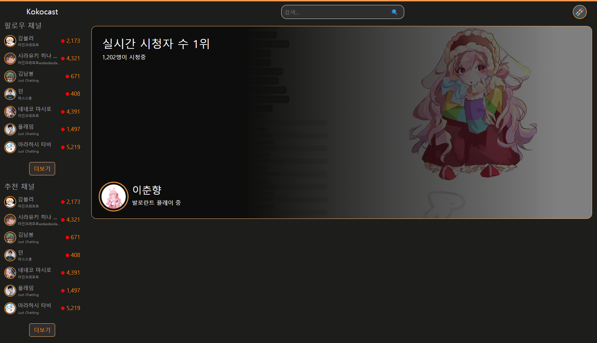
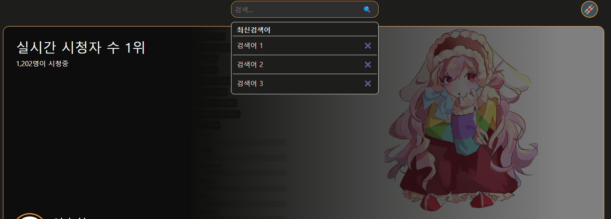

# 상단 헤더, 실시간 시청자 수 1위 컴포넌트 개발 (2)

## 디자인

  

  

기본적인 틀만 생성하였음. 검색어 미리보기도 구현완료

## 추가로 필요한 작업

- [x] 실시간 시청자수 1위  방송 정보 디테일한 디자인
    - [x] 폰트, 글자 크기 정리, marin, padding 수정, 글자색
    - [x] 전체 영역을 동적으로 먹게하고, 배경색으로 디테일한 디자인 추가
- [x] 검색어 미리보기 디테일 디자인 수정
- [x] 프로필 드롭다운 메뉴 디자인 수정 => 프로필 페이지 할 떄 진행하기로 수정

### 우선순위 1
- [ ] 메인 (17)
    - [x] 디자인 방식 (1)
        - [x] 탬플릿 / 엔진 / 구현방식 확인 : 부트스트랩 구현 하도록 함
    - [ ] 메인 페이지 디자인 (7)
        - [x] Sidebar 디자인 (2)
        - [x] 상단 및 실시간 랭킹 디자인 (3)
        - [ ] 인기클립, 쇼츠 등등 디자인 (2)
    - [ ] 방송 시청 페이지 디자인 (3)
    - [ ] 사용자 설정 페이지 디자인 (3)
    - [ ] 검색 페이지 디자인 (3)
- [ ] 사용자 (17)
    - [ ] 로그인 / 회원가입 (13)
        - [ ] 사용자 DB 생성 (2)
        - [ ] 암호화 / 로그인 / 회원가입 서버 구현 (3)
        - [ ] 로그인 페이지 생성 (2)
        - [ ] 회원가입 페이지 생성 (2)
        - [ ] 클라 / 서버 연동 (2)
        - [ ] 채널 DB 생성 (2)
    - [ ] 팔로우 (4)
        - [ ] 서버 팔로우 기능 구현 (2)
        - [ ] 방송 시청 페이지 팔로우 버튼 연동 (2)
- [ ] 방송 (25)
    - [ ] 채널 설정 (5)
        - [ ] 채널 설정 폼 생성 (2)
        - [ ] 채널 설정 서버 연동 (3)
    - [ ] 실시간 방송 (10)
        - [ ] RTMP 서버 생성 (2)
        - [ ] 스트림 키 생성 (2)
        - [ ] 서버 모니터링 / 방송 송출 설정 (3)
        - [ ] 방송 시청 페이지 디자인 후 연동 (3)
    - [ ] 채팅 (10)
        - [ ] 채팅 서버 구현 (5)
        - [ ] 채팅 서버 연동 (5)

Manday상 여유롭게 2달 정도 시간이 걸릴 것으로 예상 됨.

### 우선순위 2
- [ ] 사용자
    - [ ] 구독
    - [ ] 밴
- [ ] 방송
    - [ ] 다시보기
    - [ ] 클립 (영상 자르기 기능)
    - [ ] 투표 열기 / 도박
    - [ ] 결제
    - [ ] 도네이션 (방송에 도네 띄우기)
- [ ] 기타
    - [ ] 커뮤니티
    - [ ] 검색

### 우선순위 3

- [ ] 사용자
    - [ ] 알림설정
- [ ] 방송
    - [ ] 투표 열기 / 도박
    - [ ] 영상 도네이션
    - [ ] 음성 도네이션
    - [ ] TTS
    - [ ] 룰렛
- [ ] 기타
    - [ ] 추천 스트리머
    - [ ] 추천 클립
- [ ] OBS 연동
    - [ ] 제목 연동 (OBS에서 제목/카테고리 설정)
    - [ ] 채팅창 연동 (채팅창 띄우기)
