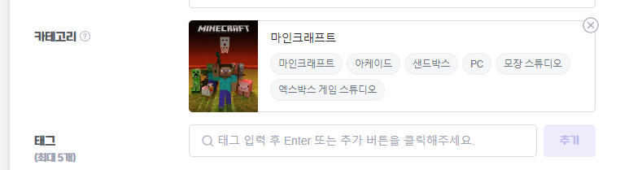

# 게임 카테고리 관련 작업

게임 카테고리를 별개의 ElasticSearch 검색엔진을 이용해서 검색할 수 있도록 만듭니다.
여기에서 검색 조건들을 디테일하게 설정하고 구현합니다.

### 검색 조건

- 해당 단어로 시작하는 모든 게임 카테고리를 조회해서, 10개까지만 끊어서 표시합니다.
- 게임 카테고리는 동일한 이름으로 여러개 추가가 불가능해야 합니다.
- 선택한 게임 카테고리는 선택했다는 별개의 표시가 필요합니다.

예시 이미지

- 게임에 해당하는 추가 카테고리 등등은 일단 미구현 상태로 놔둡니다.
- 카테고리를 진행중인 방송 카테고리로 설정하는 것을 추가합니다.

### 우선순위 1
- [ ] 메인 (17)
    - [x] 디자인 방식 (1)
        - [x] 탬플릿 / 엔진 / 구현방식 확인 : 부트스트랩 구현 하도록 함
    - [x] 메인 페이지 디자인 (7)
        - [x] Sidebar 디자인 (2)
        - [x] 상단 및 실시간 랭킹 디자인 (3)
        - [x] 인기클립, 쇼츠 등등 디자인 (2)
    - [ ] 방송 시청 페이지 디자인 (5h)
    - [x] 사용자 설정 페이지 디자인 (3)
    - [ ] 검색 페이지 디자인 (3h)
- [ ] 사용자 (17)
    - [x] 로그인 / 회원가입 (13)
        - [x] 사용자 DB 생성 (2)
        - [x] 암호화 / 로그인 / 회원가입 서버 구현
        - [x] 로그인 페이지 생성 (2)
        - [x] 회원가입 페이지 생성 (2)
        - [x] 클라 / 서버 연동 (2)
    - [ ] 팔로우 (4)
        - [ ] 서버 팔로우 기능 구현 (3h)
        - [ ] 방송 시청 페이지 팔로우 버튼 연동 (1h)
- [ ] 방송 (25)
    - [ ] 채널 설정 (5)
        - [x] 채널 DB 생성 (2)
        - [x] 채널 설정 폼 생성 (2)
        - [x] 채널 설정 서버 연동 (3)
    - [ ] 실시간 방송 (10)
        - [ ] RTMP 서버 생성 (2h)
        - [ ] 스트림 키 생성 (1h)
        - [ ] 서버 모니터링 / 방송 송출 설정 (3h)
        - [ ] 방송 시청 페이지 디자인 후 연동 (3h)
    - [ ] 채팅 (10)
        - [ ] 채팅 서버 구현 (10h)
        - [ ] 채팅 서버 연동 (5h)

Manday상 여유롭게 2달 정도 시간이 걸릴 것으로 예상 됨.

### 우선순위 2
- [ ] 사용자
    - [ ] 구독
    - [ ] 밴
- [ ] 방송
    - [ ] 다시보기
    - [ ] 클립 (영상 자르기 기능)
    - [ ] 투표 열기 / 도박
    - [ ] 결제
    - [ ] 도네이션 (방송에 도네 띄우기)
- [ ] 기타
    - [ ] 커뮤니티
    - [ ] 검색

### 우선순위 3

- [ ] 사용자
    - [ ] 알림설정
- [ ] 방송
    - [ ] 투표 열기 / 도박
    - [ ] 영상 도네이션
    - [ ] 음성 도네이션
    - [ ] TTS
    - [ ] 룰렛
- [ ] 기타
    - [ ] 추천 스트리머
    - [ ] 추천 클립
- [ ] OBS 연동
    - [ ] 제목 연동 (OBS에서 제목/카테고리 설정)
    - [ ] 채팅창 연동 (채팅창 띄우기)
